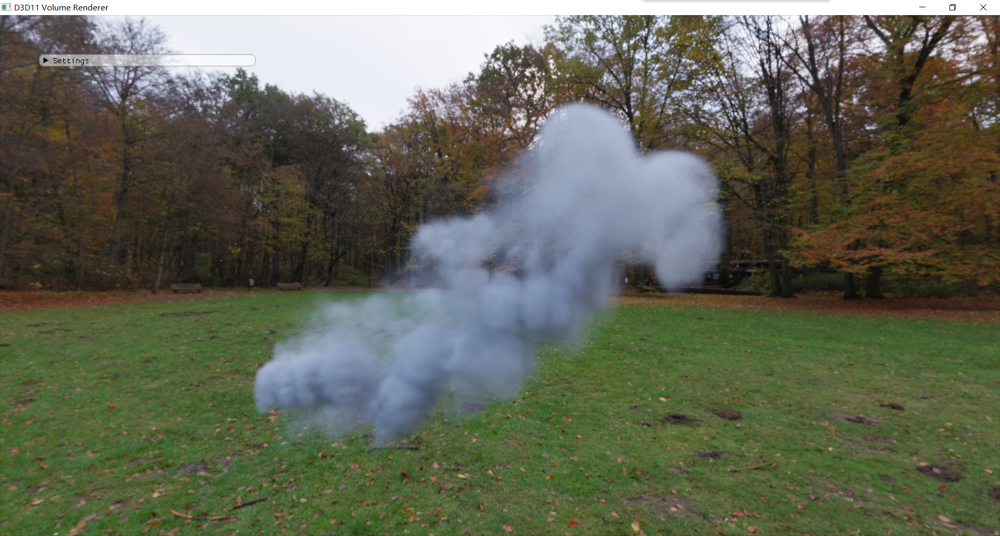

# D3D11-Volume

My personal physically based volume rendering lab on GPU

May add more rendering algos in the future : )



[density data](https://www.pbrt.org/scenes-v3) [envir light data](https://hdrihaven.com/hdris/)

 ## Build

```powershell
git clone --recursive https://github.com/AirGuanZ/D3D11-Volume.git
cd D3D11-Volume
mkdir build
cd build
cmake ..
```

## Control

`W, S, A, D, Space, LeftShift, LeftCtrl`